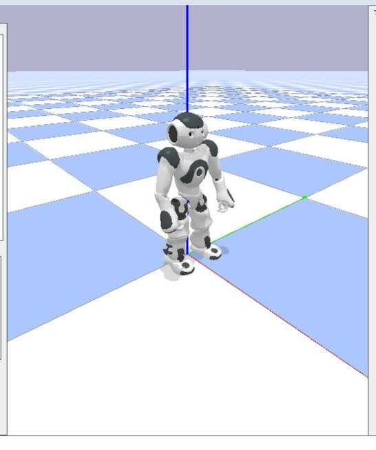
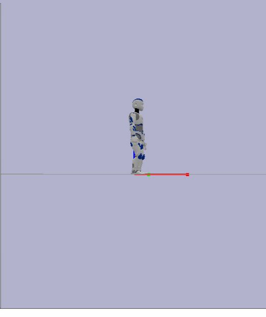

# Taller-3-corte-
Estudiantes:Rodian Garay & Mariana Lombana
---

Este taller reúne tres ejercicios clave del tercer corte, cada uno enfocado en un área distinta pero esencial dentro del desarrollo y las operaciones modernas
--- 
## Índice
1. Humanoid Gym  
2. Algoritmo de Segmentos  
3. Kubernetes
--- 
# 1. Humanoid Gym  
Simulación y control manual de robots humanoides (NAO, Pepper, Romeo y Dancer) usando **Gym**, **PyBullet** y **QiBullet**  
---

##  Descripción del Proyecto
desarrollo completo de un entorno de simulación basado en **humanoid-gym**, permitiendo controlar manualmente robots humanoides mediante sliders en PyBullet.  
Se implementaron ambientes funcionales para los robots:

- **NAO**
- **Pepper**
- **Romeo**
- **Dancer** (

El sistema permite:
- Crear entornos Gym (`robot-v0`)
- Visualizar simulaciones en PyBullet GUI  
- Controlar cada articulación del robot en tiempo real  
- Ejecutar pruebas automáticas (`env.step()`)    
- Cargar robots con sus URDF y recursos originales de QiBullet  

---
##  Tecnologías y librerías usadas

| Tecnología | Uso |
|-----------|-----|
| **Python 3.8+** | Lenguaje principal |
| **Gym (OpenAI)** | Definición de entornos RL |
| **PyBullet** | Física y visualización (GUI) |
| **QiBullet** | Simulación específica de los robots NAO, Pepper y Romeo |
| **humanoid-gym** | Base de los entornos personalizados |
| **Docker** | Contenedor portable del proyecto |
| **GitHub + DockerHub** | Versionamiento y publicación |

---

##  Instalación

### 1. Crear entorno virtual
```bash
python3 -m venv .venv
source .venv/bin/activate
```

### 2. Instalar dependencias
```bash
pip install -r requirements.txt
```

### 3. Instalar humanoid-gym en modo desarrollo
```bash
pip install -e .
```

### 4. Primera ejecución con robots QiBullet  
QiBullet descargará los recursos (URDF, meshes).  
Debe aceptarse:

```
The robot meshes and URDFs will be installed…
Continue the installation (y/n)? y
```

---

##  Robots implementados

Se desarrollaron y probaron entornos para:

| Robot | Gym ID | Estado |
|--------|--------|---------|
| NAO | `nao-v0` | ✔️ Funcional |
| Pepper | `pepper-v0` | ✔️ Funcional |
| Romeo | `romeo-v0` | ✔️ Funcional |
| Dancer | `dancer-v0` | ✔️  Funcional |

Todos soportan:
- `reset()`
- `step()`
- `action_space`
- `observation_space`
- Control manual mediante sliders PyBullet  

---

## Ejecución para cada robot

### NAO
```python
import gym, humanoid_gym
env = gym.make('nao-v0')
env.reset()
print(env.action_space)
print(env.observation_space)
```

### Pepper
```python
env = gym.make('pepper-v0')
env.reset()
```

### Romeo
```python
env = gym.make('romeo-v0')
env.reset()
```

### Dancer
```python
env = gym.make('dancer-v0')
env.reset()
```

---

##  Control manual con sliders

Código unificado para cualquier robot:

```python
import gym, humanoid_gym
import pybullet as p

env = gym.make("nao-v0")   # cambiar a pepper-v0, romeo-v0, dancer-v0
env.reset()

motor_ids = []
for name, low, up in zip(env.joint_names, env.lower_limits, env.upper_limits):
    motor_ids.append(p.addUserDebugParameter(name, low, up, 0))

while True:
    actions = [p.readUserDebugParameter(i) for i in motor_ids]
    env.step(actions)
    env.render()
```

---

##  Docker

### Construir imagen
```bash
docker build -t humanoid-gym .
```

### Ejecutar contenedor
```bash
docker run -it humanoid-gym
```

---

##  Estructura del repositorio

```
humanoid-gym/
│
├── humanoid_gym/
│   ├── envs/
│   │   ├── nao_env.py
│   │   ├── pepper_env.py
│   │   ├── romeo_env.py
│   │   └── dancer_env.py   ← añadido
│   └── __init__.py
│
├── examples/
│   ├── human_control_nao.py
│   ├── human_control_pepper.py
│   ├── human_control_romeo.py
│   └── human_control_dancer.py  ← añadido
│
├── Dockerfile
├── requirements.txt
└── README.md
```
---
##  Evidencia fotografica
 
 
 
 

---
# 2. Algoritmo de Segmentos  

---
# 3.3. Kubernetes
Se implementa un **servidor de juego multijugador** basado en Node.js + Socket.io, el cual se ejecuta en **contenedores Docker** y se despliega en un **cluster Kubernetes** con múltiples réplicas balanceadas automáticamente.

El objetivo es comprender:
✔ qué es Kubernetes
✔ cómo se relaciona con los contenedores
✔ cómo crear imágenes Docker
✔ cómo desplegar aplicaciones distribuidas
✔ cómo manejar concurrencia (mutex, semáforos, sección crítica)
✔ cómo mejorar interfaces y comunicación en tiempo real


---

# 📌 1 — ¿Qué es Kubernetes? 

Kubernetes (K8s) es una plataforma **open-source** diseñada por Google para automatizar la administración de aplicaciones basadas en contenedores.
Su objetivo principal es proporcionar un sistema robusto, escalable y auto-reparable.

---

## 🔷 1.1 Contenedores vs Máquinas Virtuales

### **Máquinas Virtuales (VMs):**

* Requieren un sistema operativo completo.
* Alto consumo de recursos.
* Lentas para iniciar.

### **Contenedores (Docker, containerd):**

* Comparten el kernel del host.
* Livianos y rápidos.
* Mayor portabilidad.
* Ideal para microservicios.

Kubernetes opera sobre contenedores porque son *inmutables**, *escalables** y *portables**.

---

##  1.2 Componentes internos de Kubernetes

### **Master Node (Control Plane)**

Encargado de la lógica del clúster:

* **API Server**: puerta de entrada al cluster (kubectl se comunica aquí).
* **Scheduler**: decide en qué nodo correr cada pod.
* **Etcd**: base de datos distribuida clave-valor, guarda el estado del cluster.
* **Controller Manager**: mantiene el estado deseado (réplicas, autoreparación).

### **Worker Nodes**

Ejecutan los contenedores:

* **Kubelet**: agente del nodo, ejecuta pods.
* **Kube-proxy**: gestiona redes y balanceo de tráfico.
* **Runtime (Docker/containerd)**: ejecuta los contenedores.

---

##  1.3 Objetos esenciales

| Objeto                 | Función                                        |
| ---------------------- | ---------------------------------------------- |
| **Pod**                | Unidad mínima de ejecución.                    |
| **Deployment**         | Controla versiones, réplicas, actualizaciones. |
| **Service**            | Expone pods y realiza balanceo.                |
| **ReplicaSet**         | Garantiza número de réplicas.                  |
| **ConfigMap / Secret** | Configuración externa al código.               |

---

## 1.4 ¿Por qué Kubernetes es importante?

* Autoescalado de réplicas (HPA)
* Reinicio automático de pods fallidos
* Balanceo interno de carga
* Ideal para microservicios distribuidos
* Portatil: funciona igual en AWS, Azure, GCP, Minikube, etc.
* Facilita despliegues continuos

---

---

# ÍTEM 2 — Docker: teoría + creación paso a paso

##  2.1 ¿Qué es Docker?

Docker es un motor de contenedores que permite empaquetar aplicaciones junto a sus dependencias, garantizando que se ejecuten siempre igual sin importar el sistema operativo del host.

---

##  2.2 Arquitectura interna de Docker

* **Docker Engine**: daemon principal.
* **Docker CLI**: interfaz de comandos.
* **Docker Images**: plantillas inmutables.
* **Docker Containers**: instancias en ejecución.
* **Docker Hub**: repositorio de imágenes.

---

##  2.3 Crear el servidor del juego

### Archivo: `server.js`

```js
// server.js
const express = require("express");
const http = require("http");
const { Server } = require("socket.io");

const app = express();
const server = http.createServer(app);
const io = new Server(server);

let players = {};

app.get("/", (req, res) => {
  res.send("<h1>Bienvenido al Juego Multijugador</h1>");
});

io.on("connection", (socket) => {
  console.log("Jugador conectado:", socket.id);

  players[socket.id] = { x: 0, y: 0 };
  io.emit("state", players);

  socket.on("move", (data) => {
    players[socket.id] = data;
    io.emit("state", players);
  });

  socket.on("disconnect", () => {
    delete players[socket.id];
    io.emit("state", players);
  });
});

server.listen(3000, () => {
  console.log("Servidor escuchando en puerto 3000");
});
```

---

##  2.4 Crear la imagen Docker

### Archivo: `Dockerfile`

```Dockerfile
FROM node:18-alpine
WORKDIR /app
COPY server.js .
RUN npm install express socket.io
EXPOSE 3000
CMD ["node", "server.js"]
```

Construcción:

```bash
docker build -t juego-multijugador:v1 .
```

---

---

#  ÍTEM 3 — Despliegue en Kubernetes

##  Deployment: controla las réplicas del juego

Archivo: **`juego-deployment.yaml`**

```yaml
apiVersion: apps/v1
kind: Deployment
metadata:
  name: juego-multijugador
spec:
  replicas: 3
  selector:
    matchLabels:
      app: juego
  template:
    metadata:
      labels:
        app: juego
    spec:
      containers:
        - name: servidor-juego
          image: juego-multijugador:v1
          ports:
            - containerPort: 3000
```

Aplicar:

```bash
kubectl apply -f juego-deployment.yaml
kubectl get pods
```

---

##  Service: expone y balancea usuarios

Archivo: **`juego-service.yaml`**

```yaml
apiVersion: v1
kind: Service
metadata:
  name: juego-service
spec:
  type: NodePort
  selector:
    app: juego
  ports:
    - port: 3000
      targetPort: 3000
      protocol: TCP
```

Aplicar:

```bash
kubectl apply -f juego-service.yaml
kubectl get svc
```

---

##  Obtener URL desde Minikube

```bash
minikube service juego-service --url
```

---

---

#  ÍTEM 4 — Concurrencia (Hilos, Mutex, Semáforos y Sección Crítica)

Aunque Node.js usa un modelo **single-threaded**, permite trabajar con concurrencia segura mediante Worker Threads y librerías de sincronización.

---

##  4.1 Sección crítica

Cualquier operación que modifica el estado global del juego:

```js
players[socket.id] = data;
```

---

##  4.2 Mutex (evita que dos jugadores modifiquen simultáneamente)

```bash
npm install async-mutex
```

```js
const { Mutex } = require("async-mutex");
const mutex = new Mutex();

socket.on("move", async (data) => {
  const release = await mutex.acquire();
  try {
    players[socket.id] = data;
    io.emit("state", players);
  } finally {
    release();
  }
});
```

---

##  4.3 Semáforo (limitar número de jugadores)

```js
let maxJugadores = 10;
let semaforo = maxJugadores;

io.use((socket, next) => {
  if (semaforo > 0) {
    semaforo--;
    next();
  } else {
    next(new Error("Servidor lleno"));
  }
});

socket.on("disconnect", () => {
  semaforo++;
});
```

---

##  4.4 Hilos (Worker Threads)

Archivo: **`actualizador.js`**

```js
const { parentPort } = require("worker_threads");

setInterval(() => {
  parentPort.postMessage({ timestamp: Date.now() });
}, 1000);
```

Uso:

```js
const { Worker } = require("worker_threads");
const worker = new Worker("./actualizador.js");

worker.on("message", (msg) => {
  console.log("Actualización desde worker:", msg);
});
```

---

---

#  Referencias Bibliográficas

✔ Kubernetes Documentation — [https://kubernetes.io/docs](https://kubernetes.io/docs)
✔ Docker Documentation — [https://docs.docker.com](https://docs.docker.com)
✔ Socket.io Docs — [https://socket.io/docs](https://socket.io/docs)
✔ Node.js Worker Threads — [https://nodejs.org/api/worker_threads.html](https://nodejs.org/api/worker_threads.html)
✔ Tanenbaum, A. *Modern Operating Systems* (2019)
✔ Brendan Burns. *Designing Distributed Systems* (Microsoft Press, 2018)

---

